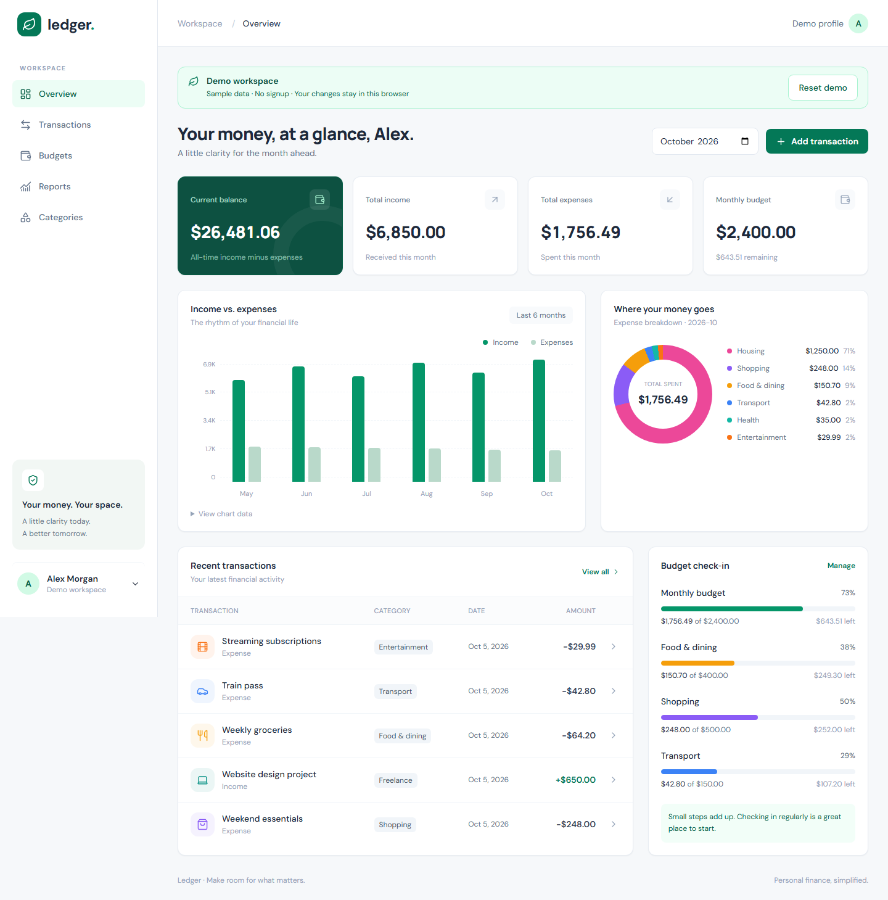
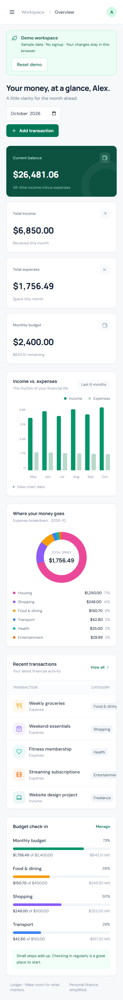
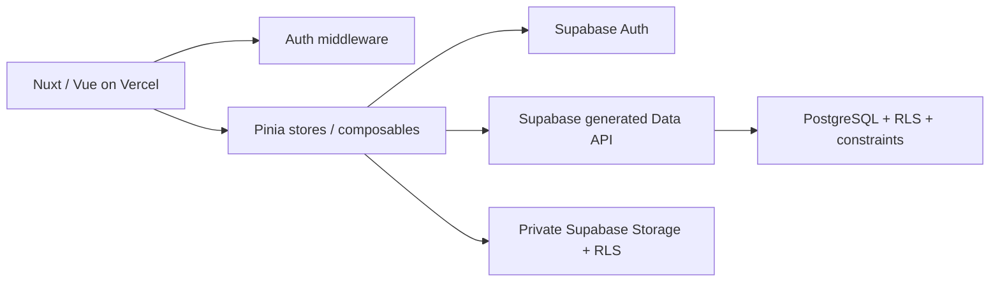
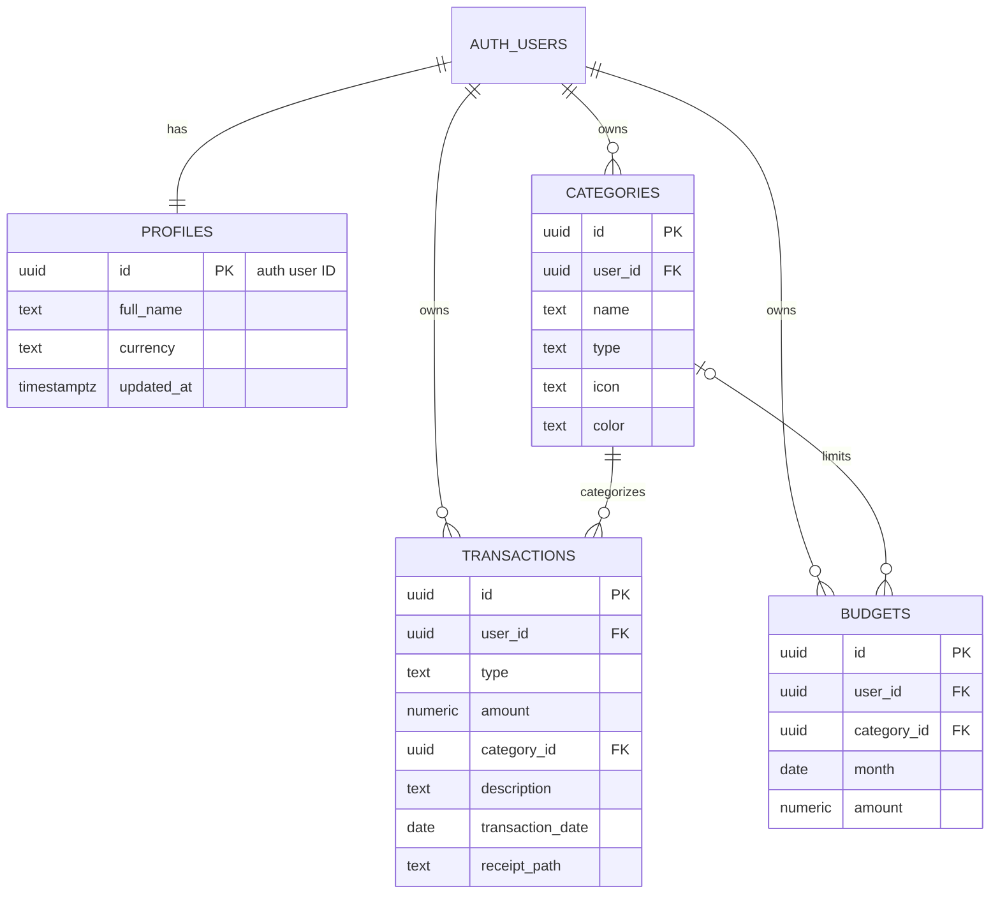

# Ledger · Personal Expense Tracker

A public portfolio demo built with **Nuxt 3, Vue 3, TypeScript, and Supabase**. Ledger opens immediately with six months of sample financial data. No signup is required, and each visitor's edits stay in their browser. The complete authenticated Supabase application remains available as an optional configuration.

This portfolio project demonstrates typed frontend architecture, authentication lifecycle management, database-enforced authorization, relational integrity, and automated testing. Supabase provides the backend; there is no separate REST server or backend framework.

## Features

- Public demo by default: browser-local transactions, categories, budgets, profile preferences, and receipts; persistence across reloads and a confirmed reset action.
- Email/password registration, email confirmation, persistent login, logout, protected routes, and account profiles.
- Dashboard with monthly income and expenses, all-time ledger balance, remaining monthly budget, recent activity, category breakdown, and six-month trends.
- Transaction creation, editing, deletion, detail views, description search, type/category/date filters, sorting, and server-side pagination.
- Custom income and expense categories with icons and colors; ten defaults created automatically on signup.
- Overall monthly budgets and category limits with actual spending, remaining amounts, percentages, and overspending indicators.
- Date-filtered reports, monthly trends, category breakdowns, budget performance, savings statistics, and CSV export.
- Optional private JPEG, PNG, WebP, and PDF receipts with a 5 MB limit and short-lived signed download URLs.
- Desktop sidebar, mobile navigation, native modal focus containment, keyboard focus styles, accessible labels, chart data tables, and loading/error/empty/success states.

## Screenshots

Screenshots are captured from the public demo by `npm run test:e2e`. All amounts and account names are synthetic; production data is never used.



<details>
<summary>Mobile workspace</summary>



</details>

## Technology

| Layer        | Technology                                             |
| ------------ | ------------------------------------------------------ |
| Application  | Nuxt 3, Vue 3 Composition API, TypeScript              |
| Styling      | Tailwind CSS, Lucide icons                             |
| Shared state | Focused Pinia stores                                   |
| Backend      | Supabase Auth, PostgreSQL, Storage, generated Data API |
| Validation   | Zod and database constraints                           |
| Quality      | ESLint, Prettier, strict TypeScript                    |
| Testing      | Vitest, Vue Test Utils, Playwright, PostgreSQL pgTAP   |
| Deployment   | Vercel frontend, hosted Supabase backend               |

Use **Node 24 LTS** and npm. The lockfile pins the tested dependency graph. Nuxt is deliberately kept on major version 3 to match the project requirements.

## Architecture

With `NUXT_PUBLIC_DEMO_MODE=true` (the default), stores use a validated local repository: financial records live in localStorage and receipt files live in IndexedDB. No Supabase client is created and no financial data or receipts are uploaded. Browser profiles have separate workspaces; tabs in the same browser share saved data. Clearing site storage removes edits. This is a sample workspace, not a secure vault for sensitive financial records. Reset restores sample data and removes demo receipts.

With `NUXT_PUBLIC_DEMO_MODE=false`, the same pages and forms use Supabase authentication, PostgreSQL, and private Storage:



The application is client-rendered (`ssr: false`): financial pages do not need public SEO, and Supabase persists sessions in browser storage. The Nuxt plugin owns one typed Supabase client. Auth middleware waits for session restoration before rendering protected pages. Authentication changes clear shared financial state, including changes from another browser tab.

`auth`, `transactions`, `categories`, and `budgets` stores hold shared state and data operations. Dashboard and report results are scoped to their pages. Components handle presentation; Zod schemas and pure finance utilities centralize validation and calculations. A PostgreSQL `finance_summary` function aggregates under invoker rights and RLS, avoiding Supabase's 1,000-row API limit. CSV export retrieves all matching records in deterministic pages.

```text
assets/css/             Global design tokens and Tailwind layers
components/             Navigation, forms, tables, charts, budgets, UI primitives
composables/            Supabase access and asynchronous feedback
layouts/                Authentication and protected application shells
middleware/             Global authentication guard
pages/                  All requested application routes
plugins/                Typed Supabase client
stores/                 Focused Pinia stores
types/                  Database and application models
utils/                  Validation, finance calculations, CSV, chart data
supabase/migrations/    Reproducible schema, triggers, RLS, private bucket
supabase/tests/         Real PostgreSQL authorization tests
tests/                  Unit, component, and browser integration tests
scripts/                Local-only integration test runner
```

## Database design



Amounts use `numeric(12,2)` and must be positive. Dates use PostgreSQL `date`; audit timestamps use `timestamptz` with update triggers. Category names are unique per user and type, ignoring case and surrounding whitespace. Composite foreign keys include owner and type, preventing references to another account's category and mismatched income/expense categories. Budgets accept only expense categories. A NULL category denotes the overall monthly limit; a unique index using `NULLS NOT DISTINCT` allows only one such budget per month. This requires PostgreSQL 15 or newer.

Category budgets sit within the overall budget; they are not summed into a second overall limit. The current balance is all recorded income minus expenses, including future-dated entries. Reports show selected-date totals, while budget performance compares full calendar-month spending. There is one display currency per account; changing it relabels amounts and does not perform currency conversion.

## Supabase setup

These steps are only required for authenticated mode. The public demo needs no Supabase project or API key. Set `NUXT_PUBLIC_DEMO_MODE=false` to enable the backend.

1. Create a Supabase project running PostgreSQL 15 or newer.
2. In SQL Editor, run the files in [`supabase/migrations/`](supabase/migrations/) in filename order **before creating application users**. The initial migration creates tables, ownership policies, signup defaults, aggregate RPC, and the private receipt bucket; the second expands the supported profile currencies to 42. For an existing database, apply only migrations that have not yet been applied.
3. Alternatively, install/use the CLI, run `npx supabase login`, `npx supabase link --project-ref YOUR_PROJECT_REF`, and `npx supabase db push`. Never run reset against a production database.
4. In Authentication → URL Configuration, set Site URL to your frontend origin and allow `http://localhost:3000/login` plus `https://YOUR_DOMAIN/login` for confirmation callbacks.
5. Enable email/password authentication and email confirmation. Configure production SMTP, email rate limits, and a suitable password policy. Local confirmation emails appear in the Supabase Mailpit interface.
6. Copy the project URL and **publishable key (or legacy anon key)** from the project connection settings into `.env`.

For local Supabase, install Docker and run:

```sh
npx supabase@2.119.0 start
```

The CLI automatically applies migrations when initializing the local database. Copy its local API URL and public anon key into `.env`. `npx supabase status` shows local endpoints, including the confirmation mail inbox. Keep confirmation enabled when testing the signup flow.

## RLS and security

Every user-owned table has RLS enabled and explicit SELECT, INSERT, UPDATE, and DELETE policies for the `authenticated` role. SELECT/DELETE use `auth.uid()` ownership checks; INSERT checks ownership; UPDATE checks both existing and resulting ownership. Anonymous table access is revoked. UI filtering is a convenience, not an authorization boundary.

The signup trigger uses a fixed empty search path and tightly scoped security-definer behavior. `finance_summary` uses **security invoker**, so caller permissions and RLS remain active. Composite foreign keys protect category ownership independently of the UI.

The `receipts` bucket is private, with MIME/size limits and policies requiring the first object path segment to match the authenticated user's UUID. Downloads use signed URLs valid for 60 seconds. Receipt replacement and transaction deletion clean up old objects; uploads are removed if the database write fails. Storage and database writes are separate operations, so network failures can leave unused objects. Cleanup failures are logged and can be reconciled operationally; a scheduled orphan cleanup is a future improvement.

Only public Supabase configuration reaches the browser. **Never use a service-role key in Nuxt runtime configuration.** `.env`, local CLI state, build artifacts, and test results are ignored by Git. The integration runner reads an admin key from the disposable local stack into its test process only and refuses hosted URLs. It never writes that key to a file or passes it through `NUXT_PUBLIC_*`.

CSV cells escape quotes and neutralize formula prefixes. Descriptions render as plain text. Form checks are paired with database constraints, so direct API callers still face validation and ownership enforcement.

Security references: [Supabase RLS](https://supabase.com/docs/guides/database/postgres/row-level-security), [private Storage policies](https://supabase.com/docs/guides/storage/security/access-control), and [Supabase client initialization](https://supabase.com/docs/reference/javascript/initializing).

## Local development

```sh
npm ci
cp .env.example .env
# Demo mode needs no credentials.
npm run dev
```

On PowerShell, use `Copy-Item .env.example .env` instead of `cp`. Open `http://localhost:3000` to explore the sample workspace immediately. Login and register routes redirect to the dashboard in demo mode. For authenticated mode, set the flag to false and provide Supabase configuration; then register, confirm email, and sign in. New real accounts have default categories and an empty ledger.

| Environment variable       | Required           | Purpose                                                         |
| -------------------------- | ------------------ | --------------------------------------------------------------- |
| `NUXT_PUBLIC_DEMO_MODE`    | No                 | Defaults to `true`; set `false` for authenticated Supabase mode |
| `NUXT_PUBLIC_SUPABASE_URL` | Authenticated mode | Supabase project API URL                                        |
| `NUXT_PUBLIC_SUPABASE_KEY` | Authenticated mode | Public publishable or anon key; RLS enforces access             |

Restart the development server after changing environment variables. No database password, JWT secret, or service-role key is needed by the application.

## Testing and quality checks

```sh
npm run lint
npm run format:check
npm run typecheck
npm test
npm run build
npx playwright install chromium
npm run test:e2e
```

Unit and component tests cover persistent auth restoration, logout and account-switch isolation, unconfirmed signup, credentials errors, financial calculations, leap years, impossible dates, receipt constraints, formula-safe CSV, budget accessibility, pagination, demo persistence, relational guards, receipt cleanup, and corrupt-data recovery. Demo browser tests exercise edits, reload persistence, isolated visitors, receipts, budgets, export, reset, mobile navigation, and absence of Supabase requests.

With local Supabase running:

```sh
npm run test:db
npm run test:integration
```

pgTAP tests run in a rolled-back transaction and verify real table ownership, forged writes, blocked ownership changes, aggregate isolation, foreign keys, budget uniqueness, and receipt folder policies. The integration test creates disposable confirmed users and synthetic entries, exercises the real browser and Supabase APIs, tests a second user's inability to access transactions/receipts or reference another user's categories, and deletes those accounts afterward. It also captures README screenshots. Stop any existing Nuxt dev server before running integration tests so the runner's local environment is used.

GitHub Actions runs lint, formatting, type checks, unit tests, build, and browser smoke tests. Database and full integration tests run in a separate local-Supabase job.

## Vercel deployment

1. Push the repository to GitHub and import it into Vercel.
2. Use the Nuxt framework preset, Node 24, and the included `vercel.json` build command (`npm run build`). Nuxt/Nitro detects Vercel and emits its deployment output.
3. Set `NUXT_PUBLIC_DEMO_MODE=true`. No Supabase variables are required for the public demo.
4. Deploy and verify sample data, editing, browser persistence, reset, and mobile navigation.

For authenticated deployment, set `NUXT_PUBLIC_DEMO_MODE=false` and both public Supabase variables. Apply migrations before signup, configure the deployed origin and exact `/login` callback in Supabase Auth, and verify email confirmation, transaction CRUD, receipts, and account isolation. Use a separate Supabase project for staging.

For an already-built standalone preview, provide the same runtime environment and run `node .output/server/index.mjs`; `.env` is not automatically loaded by that production command. Vercel supplies environment variables to its runtime.

Before accepting production users, enable backups appropriate to your Supabase plan, verify email delivery, review logs/rate limits, and run the database security tests on a disposable environment with the same migrations. Hosted Supabase configuration is supplied through environment variables; publishing the frontend to Vercel is a separate deployment step.

## Dependency maintenance

Run `npm audit` when installing or deploying. The current Nuxt 3/Tailwind 3 tooling graph reports upstream high-severity advisories in transitive build/development dependencies, including `node-forge` and `braces`; the registry has no patched releases for those packages at verification time. The lockfile preserves the build that was tested. Do not run `npm audit fix --force` blindly: its suggested Nuxt/Tailwind downgrades break this stack and do not establish security. Restrict development servers to trusted interfaces and update the lockfile when compatible upstream fixes are available. See `docs/verification.md` for the verification record and limitations.

## Future improvements

- Password recovery, MFA, and account deletion through a trusted server workflow.
- Recurring transactions and upcoming payment reminders.
- Multiple accounts, explicit currency conversion, and opening balances.
- CSV import, richer search indexes, and receipt OCR.
- Scheduled reconciliation of orphaned Storage objects.
- Generated database types from the deployed schema and further browser accessibility checks.

## License

MIT. See [LICENSE](LICENSE).
